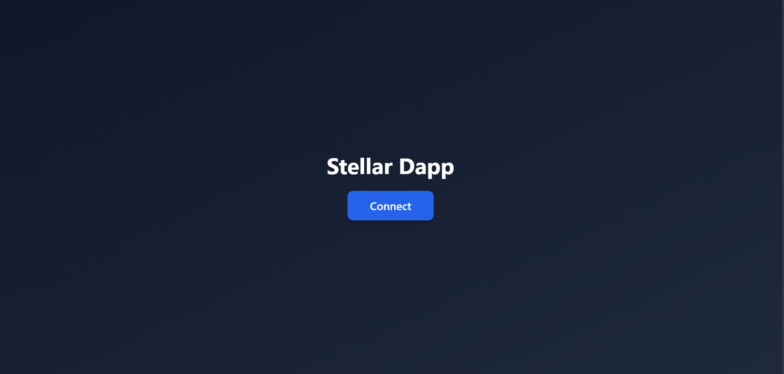
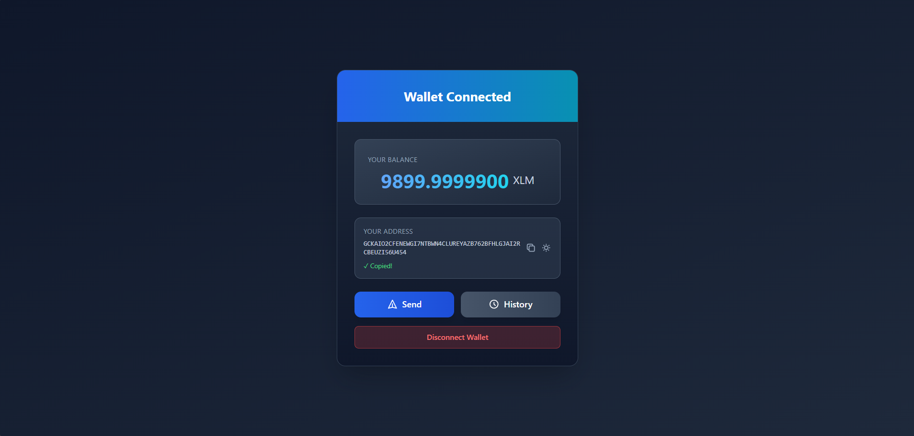
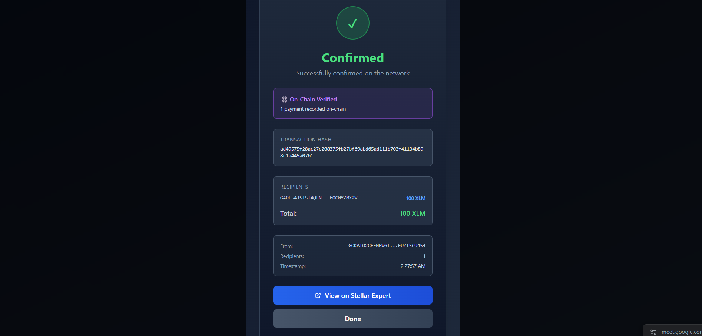
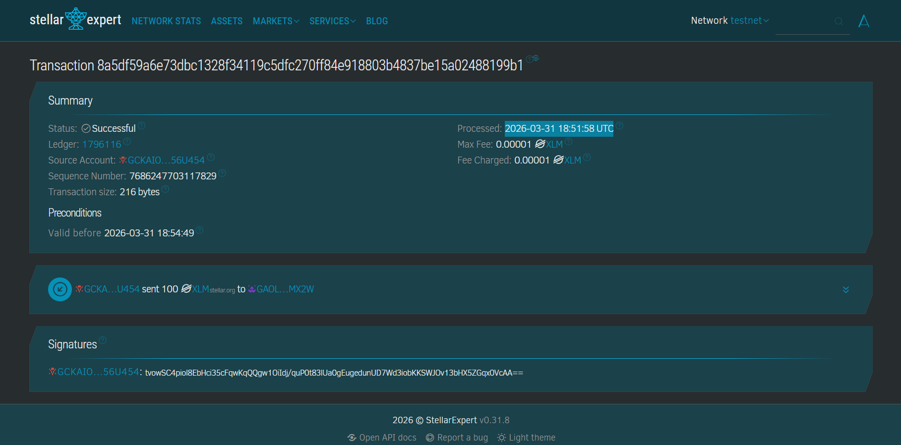

# Stellar Connect Wallet 🌟

A modern, user-friendly web application for managing Stellar (XLM) assets with seamless wallet integration, built with React and styled with Tailwind CSS.


---

## ✨ Features

- **🔗 Wallet Connection**: Seamlessly connect your Freighter wallet with one click
- **💰 Balance Display**: Real-time XLM balance from the Stellar Network
- **📬 Multi-Recipient Send**: Transfer XLM to multiple recipients (up to 100) in a single transaction
- **📝 Transaction Memo**: Add optional memo to your transactions
- **⏱️ Real-time Status Tracking**: Monitor transaction status with live polling updates
- **📊 Transaction History**: View your complete transaction history (last 50 transactions)
- **📲 QR Code**: Generate and share your public address via QR code
- **📋 Address Management**: Copy your address to clipboard instantly
- **🔐 Secure**: No private keys stored locally - all transactions signed by Freighter
- **🎨 Beautiful UI**: Modern, responsive interface with smooth animations and gradient design
- **🌙 Dark Theme**: Eye-friendly dark gradient design optimized for viewing

---

## 🚀 Quick Start

### Prerequisites
- Node.js 16+ and npm
- [Freighter Wallet](https://www.freighter.app/) browser extension installed

### Installation

```bash
# Clone the repository
git clone https://github.com/Anmol-345/stellar-challenge-level-2.git
cd stellar-connect-wallet

# Install dependencies
npm install

# Start the development server
npm start
```

The app will open at `https://localhost:3000`

### Build for Production

```bash
npm run build
```

---

## 📖 How to Use

### 1. **Connect Your Wallet**
   - Click the "Connect" button on the landing screen
   - Approve the connection in your Freighter wallet popup
   - Your wallet info will appear instantly

### 2. **View Your Balance**
   - Your XLM balance is displayed in the wallet card
   - Updates are fetched from the Stellar Network

### 3. **View Your Address**
   - Click the copy icon to copy your address to clipboard
   - Click the QR code icon to view and share your public address

### 4. **Send XLM**
   - Click the "Send" button
   - Add one or more recipients (up to 100)
   - Enter recipient address and amount for each
   - (Optional) Add a memo to your transaction
   - Review the transaction and sign with Freighter
   - Monitor real-time transaction status with polling updates
   - View confirmation once processed on Stellar Network

### 5. **Check History**
   - Click the "History" button
   - View your last 50 transactions from the Stellar Network
   - See transaction details: hash, date, type, and memo
   - Click on any transaction for more details

### 6. **Disconnect**
   - Click "Disconnect Wallet" to exit
   - Your data is cleared - no persistence

---

## 📸 Screenshots

### Landing Page
Initial screen showing "Stellar Dapp" title with Connect button.



### Wallet Connected with Balance Display
Connected wallet showing address, balance (XLM amount), and action buttons for Send/History/Disconnect.



### Successful Testnet Transaction
Transaction confirmation showing successful XLM transfer on the Stellar Testnet.



### Successful Testnet Transaction Proof
Transaction confirmation showing successful XLM transfer on the Stellar Testnet.



---

# TRANSACTION PROOF

```
Transaction Id : 8a5df59a6e73dbc1328f34119c5dfc270ff84e918803b4837be15a02488199b1
Processed      : 2026-03-31 18:51:58 UTC

```


---

## 🏗️ Project Structure

```
stellar-connect-wallet/
├── src/
│   ├── components/
│   │   ├── Freighter.js          # Freighter API integration & wallet functions
│   │   ├── SendXLM.js            # Multi-recipient send transactions component
│   │   ├── History.js            # Transaction history fetcher component
│   │   ├── TransactionStatus.js  # Real-time transaction status tracker
│   │   └── Header.js             # Header component
│   ├── lib/
│   │   └── transactionTracker.js # Transaction tracking & validation utilities
│   ├── App.js                    # Main app component & wallet management
│   ├── App.css                   # App styles
│   ├── index.js                  # Entry point
│   └── index.css                 # Global styles
├── public/
│   ├── index.html                # HTML template
│   ├── manifest.json             # PWA manifest
│   └── robots.txt
├── package.json                  # Dependencies
├── tailwind.config.js            # Tailwind configuration
└── README.md                     # This file
```

---

## 🛠️ Tech Stack

- **Frontend Framework**: [React 19.2](https://react.dev/)
- **Styling**: [Tailwind CSS 3.4](https://tailwindcss.com/)
- **Blockchain Integration**: 
  - [@stellar/stellar-sdk 15.0](https://developers.stellar.org/docs/reference/sdk-reference)
  - [@stellar/freighter-api 6.0](https://www.freighter.app/)
- **QR Code**: [qrcode.react](https://www.npmjs.com/package/qrcode.react)
- **Utilities**: [react-copy-to-clipboard](https://www.npmjs.com/package/react-copy-to-clipboard)
- **Build Tool**: [Create React App](https://create-react-app.dev/)

---

## 🔧 Key Components

### Freighter.js
Handles all blockchain interactions:
- `checkConnection()` - Verify Freighter extension is accessible
- `retrievePublicKey()` - Get user's Stellar address
- `getBalance()` - Fetch XLM balance from Horizon API
- `userSignTransaction()` - Sign transactions with Freighter wallet

### SendXLM.js
- Dynamic multi-recipient form (add/remove recipients)
- Form validation for addresses and amounts
- Stellar address format validation
- Optional transaction memo support
- Transaction building and signing
- Automatic transaction tracking integration
- Real-time status updates and notifications

### TransactionStatus.js
- Real-time transaction status tracking with polling
- Displays pending, success, or failed states
- Shows polling attempt counts
- Integrates with transaction tracker for detailed updates
- Auto-closes on completion

### History.js
- Fetches transaction data from Horizon API
- Displays last 50 transactions from account
- Shows transaction: hash, date, type, source, and memo
- Honors user's public address for privacy

### transactionTracker.js (lib/)
- Transaction validation and error parsing
- Multi-recipient support (up to 100 per transaction)
- Pending transaction storage and retrieval
- Horizon error message formatting
- Status polling with configurable intervals
- Transaction history export utilities

---

## 🌐 Network Configuration

This application is configured for the **Stellar Test Network (Testnet)**.

- **Horizon API Endpoint**: `https://horizon-testnet.stellar.org`
- **Network Passphrase**: `Test SDF Network ; September 2015`
- **Default Port**: `https://localhost:3000` (HTTPS required for wallet integration)

⚠️ **Note**: No real XLM is used. For testnet lumens, visit the [Stellar Testnet Friendbot](https://laboratory.stellar.org/?network=test#friendbot)

---

## 🔐 Security & Privacy

- **Private Keys**: Never stored or transmitted locally - Freighter wallet handles all signing
- **HTTPS Required**: All API calls use HTTPS encryption
- **Testnet Only**: Safe for development and testing (no real funds)
- **No Backend Server**: All transactions happen directly on-chain
- **No Data Persistence**: Wallet data is cleared on disconnect
- **Transaction Validation**: Client-side validation of all addresses and amounts
- **Error Handling**: Graceful error recovery with user-friendly messages

---

## 🎨 UI/UX Features

- **Responsive Design**: Optimized for desktop and mobile viewports
- **Dark Gradient Theme**: Professional dark UI with blue-cyan gradients
- **Smooth Animations**: Fade-in effects and interactive hover transitions
- **Accessible SVG Icons**: Clear, semantic icons for all actions
- **Modal Dialogs**: Non-intrusive modals for Send, History, and QR Code viewing
- **Real-time Feedback**: Loading states, success messages, and error alerts
- **Copy-to-Clipboard**: Quick address copying with visual confirmation
- **Transaction Status Indicators**: Visual feedback during processing
- **Gradient Accents**: Blue-to-cyan gradients for balance and header sections

---

## 📱 Browser Support

- **Chrome/Chromium**: 90+
- **Firefox**: 88+
- **Safari**: 14+
- **Edge**: 90+
- Requirements: ES6+ support, WebGL, localStorage enabled

---

## 🚦 Getting Started with Freighter

1. **Install Freighter Wallet**:
   - Visit [freighter.app](https://www.freighter.app/)
   - Install browser extension for Chrome, Firefox, Edge, or Safari
   - Grant necessary permissions

2. **Create or Import a Stellar Account**:
   - Launch Freighter and create a new account, or
   - Import existing account using your secret seed key
   - **Do NOT share your secret key** - store it securely offline

3. **Configure for Testnet**:
   - Open Freighter settings
   - Switch network selection to **Testnet**
   - Verify "Test SDF Network" is selected

4. **Get Testnet XLM**:
   - Visit [Stellar Testnet Friendbot](https://laboratory.stellar.org/?network=test#friendbot)
   - Enter your public key (starts with 'G')
   - Click "Get 10000 XLM" to fund your account

5. **Connect to Stellar Connect Wallet**:
   - Open [https://localhost:3000](https://localhost:3000)
   - Click the "Connect" button
   - Approve the connection in the Freighter popup
   - Your wallet info will load instantly

---

## 🐛 Troubleshooting

### Connection Issues

**"Failed to connect wallet"**
- ✅ Ensure Freighter extension is installed and active
- ✅ Make sure Freighter is unlocked (check Freighter popup)
- ✅ Verify you're on HTTPS (required for wallet connection)
- ✅ Try refreshing the page (F5)
- ✅ Check that Testnet is selected in Freighter
- ✅ Restart the browser if issues persist

### Transaction Issues

**"Invalid Stellar address" error**
- ✅ Verify recipient address starts with "G"
- ✅ Ensure address is exactly 56 characters long
- ✅ Check for typos or extra spaces
- ✅ Use addresses from the same Testnet network

**"Insufficient balance" error**
- ✅ Verify balance in wallet is sufficient
- ✅ Remember each transaction includes a 0.00001 XLM base fee
- ✅ Get more testnet XLM from [Friendbot](https://laboratory.stellar.org/?network=test#friendbot)

### Display Issues

**"No balance showing"**
- ✅ Wait a few seconds for network response
- ✅ Ensure your Freighter account has testnet XLM
- ✅ Refresh the page and reconnect wallet
- ✅ Check Horizon API status: https://horizon-testnet.stellar.org/

**QR Code not generating**
- ✅ Check browser console for JavaScript errors
- ✅ Ensure wallet address loaded successfully
- ✅ Try clearing browser cache and cookies
- ✅ Test in a different browser if issues persist

### Network Issues

**"Connection timeout" or slow responses**
- ✅ Check your internet connection
- ✅ Verify Horizon API is accessible: https://horizon-testnet.stellar.org/
- ✅ Try again in a few moments (network may be experiencing load)
- ✅ Check Stellar network status page

---

## 📚 Resources

- **Stellar Documentation**: https://developers.stellar.org/
- **Freighter Docs**: https://www.freighter.app/
- **Horizon API**: https://developers.stellar.org/docs/data/horizon
- **Tailwind CSS**: https://tailwindcss.com/docs
- **React Docs**: https://react.dev/

---

## 🤝 Contributing

Contributions are welcome! To contribute:

1. Fork the repository
2. Create a feature branch (`git checkout -b feature/amazing-feature`)
3. Commit changes (`git commit -m 'Add amazing feature'`)
4. Push to branch (`git push origin feature/amazing-feature`)
5. Open a Pull Request

---

## 📄 License

This project is licensed under the MIT License - see the LICENSE file for details.

---

## 👨‍💻 Author

Created with ❤️ for the Stellar community

---

## ⭐ Support

If you find this project helpful, please consider:
- ⭐ Starring the repository
- 🐛 Reporting bugs
- 💡 Suggesting features
- 📢 Sharing with others

<div align="center">

**Made with React + Stellar ✨**

[Install Freighter](https://www.freighter.app/) • [Stellar Docs](https://developers.stellar.org/) • [Report Bug](https://github.com/yourusername/stellar-connect-wallet/issues)

</div>
